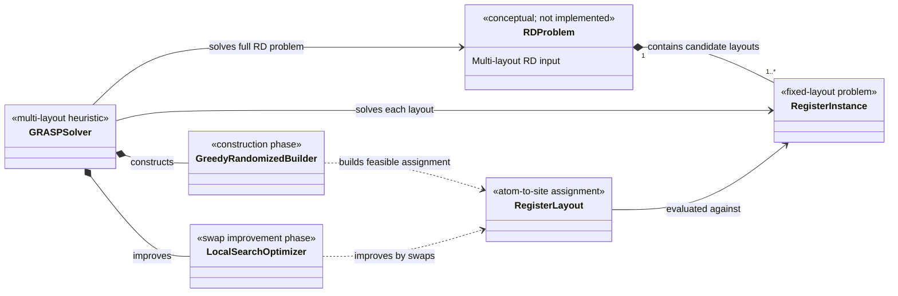

# High-Level UML: Question 6

The RD problem consists of a target QUBO matrix and multiple calibrated layouts. The GRASP heuristic solves each layout and keeps the assignment with the lowest cost. Its two main phases are randomized greedy construction and swap-based local search. `RDProblem` is a conceptual input bundle; the current API passes its target matrix and layouts separately to `solve_rd`.

