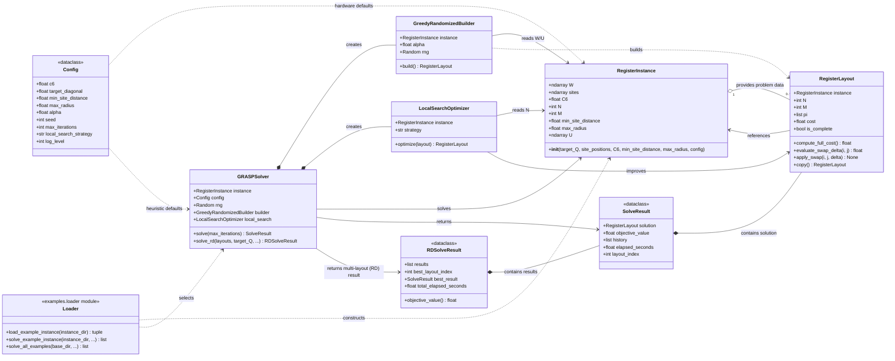

# UML : Question 6

The diagrams below describe the main domain objects and solver flow. They use Mermaid syntax and render in GitHub and VS Code Markdown previews that support Mermaid.

## Class Diagram

## Module Responsibilities

- `config.py`: immutable runtime and heuristic defaults.
- `models.py`: input validation, site interactions, assignments, objective values, and result records.
- `heuristics.py`: GRASP construction and local search.
- `examples/loader.py`: JSON instance discovery, loading, and solver dispatch.
- `main.py` and `scripts/`: runnable experiment entry points and plotting/comparison utilities.
